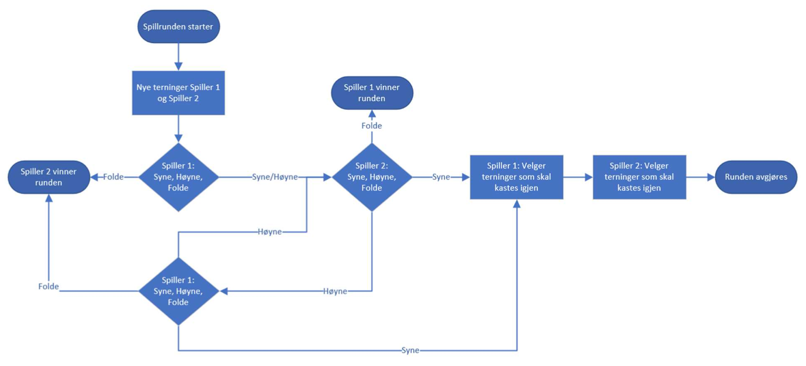

# Dice Poker

Vår designer Rune er veldig glad i spillet Witcher og deres mini-spill terningpoker. Vi teknikere pleide å spille dette live med ham i lunsjpausen den tiden vi kunne samles på kontoret. Etter så lang tid på hjemmekontoret begynner vår sosiale designer Rune å bli ekstremt lei og har gitt oss i teknisk avdeling oppgaven med å lage en elektronisk variant i stedet.

Pokerterning er et terningspill som er oddsbasert og verdien av terningkast blir bedømt i henhold til pokerregler. Spillerens terningkast er åpne for alle. Pokerdelen refererer bare til verdivurderingen av hånden. Spillet ligner på yatzy, men poker høres litt mer kult ut. Spill og konkurranse er også involvert, dette er noe vi liker på Eiendomsverdi.

## Rangering

- **Ingenting**: ingen terning treffer.
- **Ett Par**: To terninger med samme verdi.
- **To par**: To terningpar med samme verdi.
- **Tre like**: Tre terninger viser samme verdi.
- **Liten straight**: Stige med 5 som høyeste verdi.
- **Stor straight**: Stige med 6 som høyeste verdi.
- **Fullt hus**: Tre med en verdi, Par med en annen.
- **Fire like**: Fire terninger viser samme verdi.
- **Fem like**: Fem terninger viser samme verdi.

Verdien på hånden for like typer er satt med høyeste terning.

eks:
**To par**: Maksimum par, nest høyeste par, deretter høyest uovertruffen verdi.
**Fullt hus**: Høyeste trippel, deretter høyeste par.

## Spillflyt

Begge spillerne starter med 30 evCoins hver.

En runde foregår som følger:

- Ante er 1 evCoin per runde.
- Begge spillerne kaster 5 terninger.
- Spiller 1 starter deretter budrunden og kan syne, høyne eller folde.
- Spiller 2 kan deretter syne, høyne eller folde.
- Hvis det ikke er noen økning, går spillet til neste fase.
- Hvis spiller 2 høyner potten, går budrunden til spiller 1 igjen.

I neste fase bytter spillerne på hvilke terninger de skal kaste om, og når begge spillerne har gjort det, avgjøres runden og potten går til vinneren.

Når runden er avgjort, endres rollene og spiller 2 starter budrunden.

Spillet varer til noen går tom for evCoin eller lunsjpausen er over.

## Flytskjema

